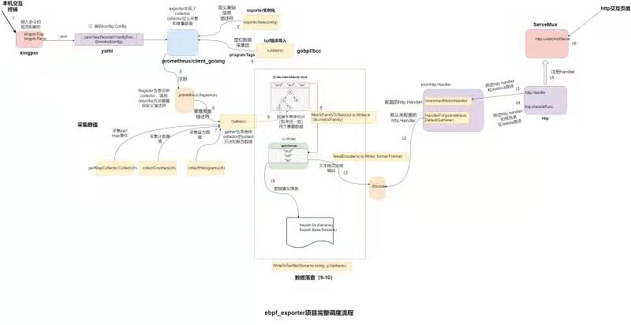

@[Toc](bpf碰上prometheus)
# 简介
bpf_exporter项目利用gobpf向kernel注入bpf程序，动态跟踪bpf运行并采集数据至metricValue，并在用户态上利用prometheus监控系统从metricValue中获取数值并进一步过滤和聚合，数据信息转换文本落盘/metrics文件。http调用Handler可直接读取io.Writer流的数据内容并以TCP返回。

# bpf_exporter的完整调度流程：



# 组成模块
## 导入和配置
1.  命令行解析
2.  配置解码
3.  exporter初始化
4.  bpf项目导入及定位数据采集区
5.  Register注册
6.  暴露描述符
## 采集数值
7.  定义collect采集数值—ebpf_exporter
8.  Gather调度collect采集数值
9.  数据组装处理
## 数据落盘
10.  数据转换
11.  数据落盘
## http调度
12.  绑定http.handler和路径
13.  配置promhttp的Handler
14.  文本格式协商编码
15.  注册handler
16.  http监听服务
# 代码分析——重点模块
## exporter结构解析
**exporter本身就是一个实现prometheus的采集器**
```
type Exporter struct {
    // 配置文件
    config              config.Config
    // bcc注册模块——数值采集区
    modules             map[string]*bcc.Module
    // perfMap event采集器
    perfMapCollectors   []*PerfMapSink
    // bpf模块内函数/变量的内核地址
    kaddrs              map[string]uint64
    // config文件的programs：-name标准描述符——描述符用于暴露数据给prometheus
    enabledProgramsDesc *prometheus.Desc
    // config文件的探针bpf函数名标准描述符
    programInfoDesc     *prometheus.Desc
    // 程序全部bpf函数的内存地址——数据采集区
    programTags         map[string]map[string]uint64
    // config度量指标的标准描述符集合——数据采集区
    descs               map[string]map[string]*prometheus.Desc
    // 解码器集合
    decoders            *decoder.Set
}
```
## 定位数据采集区
exporter.Attach是bpf程序利用bcc框架异步编译得到字节码，加载C函数并添加到对应的探针位置上，等待内核机器处理。
得到的programTags和modules分别是**数据采集区（注入内核的函数信息）和数值采集器（产生的数值结果）**
```
func (e *Exporter) Attach() error {
    // bpf_exporter可以处理多个programes
    for _, program := range e.config.Programs {
       // 防止添加重复的bcc.module
        if _, ok := e.modules[program.Name]; ok {
            return fmt.Errorf("multiple programs with name %q", program.Name)
        }
       // 返回Kaddr和bpf程序的string文本
        code, err := e.code(program)
        if err != nil {
            return err
        }
       // bcc异步编译code文本，预处理program.Cflags
        module := bcc.NewModule(code, program.Cflags)
        if module == nil {
            return fmt.Errorf("error compiling module for program %q", program.Name)
        }
       // 注入编译后的函数到探针位置
       // 所有bpf探针的载入和附加  
      tags, err := attach(module, program.Kprobes, program.Kretprobes, program.Tracepoints, program.RawTracepoints)
        if err != nil {
            return fmt.Errorf("failed to attach to program %q: %s", program.Name, err)
        }
       // programTags的key：program.Name value: 加入探针的函数名和内存地址
       //tags 的key: 函数名 value：注入内核C函数的内存地址
        e.programTags[program.Name] = tags
       // perf Event的载入和附加
        for _, perfEventConfig := range program.PerfEvents {
            target, err := module.LoadPerfEvent(perfEventConfig.Target)
            if err != nil {
                return fmt.Errorf("failed to load target %q in program %q: %s", perfEventConfig.Target, program.Name, err)
            }
            err = module.AttachPerfEvent(perfEventConfig.Type, perfEventConfig.Name, perfEventConfig.SamplePeriod, perfEventConfig.SampleFrequency, -1, -1, -1, target)
            if err != nil {
                return fmt.Errorf("failed to attach perf event %d:%d to %q in program %q: %s", perfEventConfig.Type, perfEventConfig.Name, perfEventConfig.Target, program.Name, err)
            }
        }
       // bcc模块，生成数值的采集区
       e.modules[program.Name] = module
    }
    return nil
}
```

# Register注册和暴露描述符
当prometheus注册ebpf_exporter项目version和exporter时，会进入到Register的逻辑。Register会调用exporter的Describe方法（PS：MustRegister会一次性注册多个collector模块）
**exporter模块实现的Describe模块用于暴露全部度量指标的desc集合。**
```
func (r *Registry) Register(c Collector) error {
    var (
        descChan           = make(chan *Desc, capDescChan)
        newDescIDs         = map[uint64]struct{}{}
        newDimHashesByName = map[string]uint64{}
        collectorID        uint64 // All desc IDs XOR'd together.
        duplicateDescErr   error
    )
    go func() {
        // 调用exporter的Describe方法，暴露描述符
        c.Describe(descChan)
        close(descChan)
    }()
   ...
}
```
```
func (e *Exporter) Describe(ch chan<- *prometheus.Desc) {
   // 定义度量描述符的标准，用于描述config配置度量指标的信息，用于暴露给prometheus
   addDescs := func(programName string, name string, help string, labels []config.Label) {
        if _, ok := e.descs[programName][name]; !ok {
            labelNames := []string{}
            for _, label := range labels {
                labelNames = append(labelNames, label.Name)
            }
           // 注册度量指标的标准描述符
              e.descs[programName][name] = prometheus.NewDesc(prometheus.BuildFQName(prometheusNamespace, "", name), help, labelNames, nil)
        }
          // 暴露度量指标描述符
           ch <- e.descs[programName][name]
    }
    // 暴露config文件上的program：
    ch <- e.enabledProgramsDesc
    // 暴露config文件上的bpf程序函数信息：
    ch <- e.programInfoDesc
   // 遍历每个program
   for _, program := range e.config.Programs {
        if _, ok := e.descs[program.Name]; !ok {
           // 初始化每个program的descs
            e.descs[program.Name] = map[string]*prometheus.Desc{}
        }
        for _, counter := range program.Metrics.Counters {
           // PerfMap Event数据注册Collector，perf event属于counter度量
            if len(counter.PerfMap) != 0 {
                perfSink := NewPerfMapSink(e.decoders, e.modules[program.Name], counter)
                e.perfMapCollectors = append(e.perfMapCollectors, perfSink)
            }
                // count数据注册标准描述符
                addDescs(program.Name, counter.Name, counter.Help, counter.Labels)
        }
        for _, histogram := range program.Metrics.Histograms {
           
          // histogram数据注册标准描述符
          addDescs(program.Name, histogram.Name, histogram.Help, histogram.Labels[0:len(histogram.Labels)-1])
        }
    }
}
```
## 定义collect采集数值
collect方法是collector中采集数据信息的接口，执行真正的采集动作。**关键函数：ch<-prometheus.MustNewConstMetric**
```
func (e *Exporter) Collect(ch chan<- prometheus.Metric) {
   // enabledProgramsDesc描述符的数据信息采集
   for _, program := range e.config.Programs {
        ch <- prometheus.MustNewConstMetric(e.enabledProgramsDesc, prometheus.GaugeValue, 1, program.Name)
    }
    // programInfoDesc描述符的数据信息采集
   for program, tags := range e.programTags {
        for function, tag := range tags {
               programInfoDesc描述符采集数据包含program、function和tag信息
              ch <- prometheus.MustNewConstMetric(e.programInfoDesc, prometheus.GaugeValue, 1, program, function, fmt.Sprintf("%x", tag))
        }
    }
    for _, perfMapCollector := range e.perfMapCollectors {
          // perfMap evenet事件的采集数据
          perfMapCollector.Collect(ch)
    } 
   // bpf跟踪度量指标的采集数据
    e.collectCounters(ch)
    e.collectHistograms(ch)
}
```
```
func (e *Exporter) collectCounters(ch chan<- prometheus.Metric) {
    for _, program := range e.config.Programs {
        for _, counter := range program.Metrics.Counters {
           // 排除PerfMap事件的度量指标，说明bcc和perfMap度量是分开的
            if len(counter.PerfMap) != 0 {
                continue
            }
           // 从bcc模块中获得[]metricValue数据，其中的labelvalue是由eBPF map key解码转换得到的，value值由eBPF map value直接获取
            tableValues, err := e.tableValues(e.modules[program.Name], counter.Table, counter.Labels)
            if err != nil {
                log.Printf("Error getting table %q values for metric %q of program %q: %s", counter.Table, counter.Name, program.Name, err)
                continue
            }
            desc := e.descs[program.Name][counter.Name]
            for _, metricValue := range tableValues {
                //  counter度量指标描述符的数据信息采集
                 ch <- prometheus.MustNewConstMetric(desc, prometheus.CounterValue, metricValue.value, metricValue.labels...)
            }
        }
    }
}
```
```
func (e *Exporter) collectHistograms(ch chan<- prometheus.Metric) {
    for _, program := range e.config.Programs {
        for _, histogram := range program.Metrics.Histograms {
            skip := false
            histograms := map[string]histogramWithLabels{}
            // 从bcc模块中获得[]metricValue数据
            tableValues, err := e.tableValues(e.modules[program.Name], histogram.Table, histogram.Labels)
            if err != nil {
                log.Printf("Error getting table %q values for metric %q of program %q: %s", histogram.Table, histogram.Name, program.Name, err)
                continue
            }
            // Taking the last label and using int as bucket delimiter, for example:
            //
            // Before:
            // * [sda, read, 1ms] -> 10
            // * [sda, read, 2ms] -> 2
            // * [sda, read, 4ms] -> 5
            //
            // After:
            // * [sda, read] -> {1ms -> 10, 2ms -> 2, 4ms -> 5}
            // histogram因为需要连续的信息记录，bpf只有事件响应才产生数据，并且数据要满足histogram的格式
            // 这里表示histograms的数据转换
            for _, metricValue := range tableValues {
                labels := metricValue.labels[0 : len(metricValue.labels)-1]
                key := fmt.Sprintf("%#v", labels)
                if _, ok := histograms[key]; !ok {
                    histograms[key] = histogramWithLabels{
                        labels:  labels,
                        buckets: map[float64]uint64{},
                    }
                }
               // 解析value值 
                leUint, err := strconv.ParseUint(metricValue.labels[len(metricValue.labels)-1], 0, 64)
                if err != nil {
                    log.Printf("Error parsing float value for bucket %#v in table %q of program %q: %s", metricValue.labels, histogram.Table, program.Name, err)
                    skip = true
                    break
                }
               // 采集数据记录buckets
                   histograms[key].buckets[float64(leUint)] = uint64(metricValue.value)
            }
            if skip {
                continue
            }
            desc := e.descs[program.Name][histogram.Name]
            for _, histogramSet := range histograms {
                 //按照bucket类型转换数据
                  buckets, count, sum, err := transformHistogram(histogramSet.buckets, histogram)
                if err != nil {
                    log.Printf("Error transforming histogram for metric %q in program %q: %s", histogram.Name, program.Name, err)
                    continue
                }
                // Sum is explicitly set to zero. We only take bucket values from
                // eBPF tables, which means we lose precision and cannot calculate
                // average values from histograms anyway.
                // Lack of sum also means we cannot have +Inf bucket, only some finite
                // value bucket, eBPF programs must cap bucket values to work with this.
                // 往描述符里采集数据
                ch <- prometheus.MustNewConstHistogram(desc, count, sum, buckets, histogramSet.labels...)
            }
        }
    }
}
```
## 获取内核的ebpf Table的数据（收集ebpf的统计日志）
bpf Map的key值：bpf函数名 value值：触发次数或者数值记录（按config文件metrics: table: 属性类型过滤的统计信息）
```
func (e *Exporter) tableValues(module *bcc.Module, tableName string, labels []config.Label) ([]metricValue, error) {
    values := []metricValue{}
   // 获得BPF table,tableName是要匹配输出的数据
    table := bcc.NewTable(module.TableId(tableName), module)
    iter := table.Iter()
    for iter.Next() {
        // key是从bpf table解析的“键”
        key := iter.Key()
        // raw是“字符串型”的bpf函数名
        raw, err := table.KeyBytesToStr(key)
        if err != nil {
            return nil, fmt.Errorf("error decoding key %v", key)
        }
        mv := metricValue{
            raw:    raw,
            labels: make([]string, len(labels)),
        }
       // labels是按配置文件要求解析后的labelname
       mv.labels, err = e.decoders.DecodeLabels(key, labels)
        if err != nil {
            if err == decoder.ErrSkipLabelSet {
                continue
            }
            return nil, err
        }
       value是从bpf Table解析的labelvalue，也是bpf table的“值”
       mv.value = float64(bcc.GetHostByteOrder().Uint64(iter.Leaf()))
        values = append(values, mv)
    }
    return values, nil
}
```

## Gather调度collect采集数据
```
func (r *Registry) Gather() ([]*dto.MetricFamily, error) {
    var (
        checkedMetricChan   = make(chan Metric, capMetricChan)
        uncheckedMetricChan = make(chan Metric, capMetricChan)
        metricHashes        = map[uint64]struct{}{}
        wg                  sync.WaitGroup
        errs                MultiError          // The collected errors to return in the end.
        registeredDescIDs   map[uint64]struct{} // Only used for pedantic checks
    )
   ...
    collectWorker := func() {
        for {
            // 调度collector的collect方法
            select {
            case collector := <-checkedCollectors:
                collector.Collect(checkedMetricChan)
            case collector := <-uncheckedCollectors:
                collector.Collect(uncheckedMetricChan)
            default:
                return
            }
            wg.Done()
        }
    }
 ...
    // Copy the channel references so we can nil them out later to remove
    // them from the select statements below.
    // prometheus存储collect采集到的数据
    cmc := checkedMetricChan
    umc := uncheckedMetricChan
 ...
   for {
        // 收到collect方法采集后传递的数据
        select {
        case metric, ok := <-cmc:
            if !ok {
                cmc = nil
                break
            }
            errs.Append(processMetric(
                metric, metricFamiliesByName,
                metricHashes,
                registeredDescIDs,
            ))
        case metric, ok := <-umc:
            if !ok {
                umc = nil
                break
            }
            errs.Append(processMetric(
                metric, metricFamiliesByName,
                metricHashes,
                nil,
            ))
        default:
            if goroutineBudget <= 0 || len(checkedCollectors)+len(uncheckedCollectors) == 0 {
                // All collectors are already being worked on or
                // we have already as many goroutines started as
                // there are collectors. Do the same as above,
                // just without the default.
                select {
                case metric, ok := <-cmc:
                    if !ok {
                        cmc = nil
                        break
                    }
                    errs.Append(processMetric(
                        metric, metricFamiliesByName,
                        metricHashes,
                        registeredDescIDs,
                    ))
                case metric, ok := <-umc:
                    if !ok {
                        umc = nil
                        break
                    }
                    errs.Append(processMetric(
                        metric, metricFamiliesByName,
                        metricHashes,
                        nil,
                    ))
                }
                break
            }
            // Start more workers.
            go collectWorker()
            goroutineBudget--
            runtime.Gosched()
        }
   ...
    return internal.NormalizeMetricFamilies(metricFamiliesByName), errs.MaybeUnwrap()
}
```
## 数据组装处理
数据组装处理是进一步将采集的指标数据转换成字典序切片的数据结构，用于写入到io.Writer流和暴露给prometheus server。
```
func processMetric(
  ...
        switch metricFamily.GetType() {
        case dto.MetricType_COUNTER:
            if dtoMetric.Counter == nil {
                return fmt.Errorf(
                    "collected metric %s %s should be a Counter",
                    desc.fqName, dtoMetric,
                )
            }
        case dto.MetricType_GAUGE:
            if dtoMetric.Gauge == nil {
                return fmt.Errorf(
                    "collected metric %s %s should be a Gauge",
                    desc.fqName, dtoMetric,
                )
            }
        case dto.MetricType_SUMMARY:
            if dtoMetric.Summary == nil {
                return fmt.Errorf(
                    "collected metric %s %s should be a Summary",
                    desc.fqName, dtoMetric,
                )
            }
        case dto.MetricType_UNTYPED:
            if dtoMetric.Untyped == nil {
                return fmt.Errorf(
                    "collected metric %s %s should be Untyped",
                    desc.fqName, dtoMetric,
                )
            }
        case dto.MetricType_HISTOGRAM:
            if dtoMetric.Histogram == nil {
                return fmt.Errorf(
                    "collected metric %s %s should be a Histogram",
                    desc.fqName, dtoMetric,
                )
            }
        default:
            panic("encountered MetricFamily with invalid type")
        }
    } else { // New name.
        metricFamily = &dto.MetricFamily{}
        metricFamily.Name = proto.String(desc.fqName)
        metricFamily.Help = proto.String(desc.help)
        // TODO(beorn7): Simplify switch once Desc has type.
        switch {
        case dtoMetric.Gauge != nil:
            metricFamily.Type = dto.MetricType_GAUGE.Enum()
        case dtoMetric.Counter != nil:
            metricFamily.Type = dto.MetricType_COUNTER.Enum()
        case dtoMetric.Summary != nil:
            metricFamily.Type = dto.MetricType_SUMMARY.Enum()
        case dtoMetric.Untyped != nil:
            metricFamily.Type = dto.MetricType_UNTYPED.Enum()
        case dtoMetric.Histogram != nil:
            metricFamily.Type = dto.MetricType_HISTOGRAM.Enum()
        default:
            return fmt.Errorf("empty metric collected: %s", dtoMetric)
        }
    ...
    metricFamily.Metric = append(metricFamily.Metric, dtoMetric)
    return nil
}
```
数据转换字典序切片，保证数据一致性和暴露到io.Writer流
```
func NormalizeMetricFamilies(metricFamiliesByName map[string]*dto.MetricFamily) []*dto.MetricFamily {
    for _, mf := range metricFamiliesByName {
       sort.Sort(metricSorter(mf.Metric))
    }
    names := make([]string, 0, len(metricFamiliesByName))
    
    for name, mf := range metricFamiliesByName {
        if len(mf.Metric) > 0 {
            names = append(names, name)
        }
    }
    sort.Strings(names)
    result := make([]*dto.MetricFamily, 0, len(names))
    for _, name := range names {
        result = append(result, metricFamiliesByName[name])
    }
    return result
}
```
## 数据落盘
数据落盘的完整流程是将转换后的字典序切片结构的数据分次转换成被文本处理的string字符串，后将字符串写入io.Writer流，本机可以调用io.Writer流，从而将数据写入文件。
```
func WriteToTextfile(filename string, g Gatherer) error {
    tmp, err := ioutil.TempFile(filepath.Dir(filename), filepath.Base(filename))
    if err != nil {
        return err
    }
    defer os.Remove(tmp.Name())
    mfs, err := g.Gather()
    if err != nil {
        return err
    }
    for _, mf := range mfs {
       调用转换切片到字符串，写入io.Writer流。获得io.Writer流的字节将数据写入文件
         if _, err := expfmt.MetricFamilyToText(tmp, mf); err != nil {
            return err
        }
    }
    if err := tmp.Close(); err != nil {
        return err
    }
    if err := os.Chmod(tmp.Name(), 0644); err != nil {
        return err
    }
    return os.Rename(tmp.Name(), filename)
}
```
## http调度
promhttp.Handler创建http.handler用于连接prometheus的Gatherer，这使得handler注册进http.ServeMux后，http可以监听服务并通过handler获取数据信息响应。
### 入口
```
http.Handle(*metricsPath, promhttp.Handler())
```
### prometheus的handler连接prometheus.DefaultGatherer
```
func Handler() http.Handler {
    return InstrumentMetricHandler(
        prometheus.DefaultRegisterer, HandlerFor(prometheus.DefaultGatherer, HandlerOpts{}),
    )
}
```
```
func HandlerFor(reg prometheus.Gatherer, opts HandlerOpts) http.Handler {
    var (
        inFlightSem chan struct{}
        errCnt      = prometheus.NewCounterVec(
            prometheus.CounterOpts{
                Name: "promhttp_metric_handler_errors_total",
                Help: "Total number of internal errors encountered by the promhttp metric handler.",
            },
            []string{"cause"},
        )
    )
    ...
    h := http.HandlerFunc(func(rsp http.ResponseWriter, req *http.Request) {
        if inFlightSem != nil {
            select {
            case inFlightSem <- struct{}{}: // All good, carry on.
                defer func() { <-inFlightSem }()
            default:
                http.Error(rsp, fmt.Sprintf(
                    "Limit of concurrent requests reached (%d), try again later.", opts.MaxRequestsInFlight,
                ), http.StatusServiceUnavailable)
                return
            }
        }
        // 起点：调用Gather方法收集数据
        mfs, err := reg.Gather()
        if err != nil {
            if opts.ErrorLog != nil {
                opts.ErrorLog.Println("error gathering metrics:", err)
            }
            errCnt.WithLabelValues("gathering").Inc()
            switch opts.ErrorHandling {
            case PanicOnError:
                panic(err)
            case ContinueOnError:
                if len(mfs) == 0 {
                    // Still report the error if no metrics have been gathered.
                    httpError(rsp, err)
                    return
                }
            case HTTPErrorOnError:
                httpError(rsp, err)
                return
            }
        }
       // 文本协商
        contentType := expfmt.Negotiate(req.Header)
        header := rsp.Header()
        header.Set(contentTypeHeader, string(contentType))
       // io.Writer流
        w := io.Writer(rsp)
        if !opts.DisableCompression && gzipAccepted(req.Header) {
            header.Set(contentEncodingHeader, "gzip")
            gz := gzipPool.Get().(*gzip.Writer)
            defer gzipPool.Put(gz)
            gz.Reset(w)
            defer gz.Close()
            w = gz
        }
       // 按文本协商将io.Writer流编码
        enc := expfmt.NewEncoder(w, contentType)
        var lastErr error
        for _, mf := range mfs {
            if err := enc.Encode(mf); err != nil {
                lastErr = err
                if opts.ErrorLog != nil {
                    opts.ErrorLog.Println("error encoding and sending metric family:", err)
                }
                errCnt.WithLabelValues("encoding").Inc()
                switch opts.ErrorHandling {
                case PanicOnError:
                    panic(err)
                case ContinueOnError:
                    // Handled later.
                case HTTPErrorOnError:
                    httpError(rsp, err)
                    return
                }
            }
        }
    ...
     // 超时句柄报错处理
    return http.TimeoutHandler(h, opts.Timeout, fmt.Sprintf(
        "Exceeded configured timeout of %v.\n",
        opts.Timeout,
    ))
}
```

